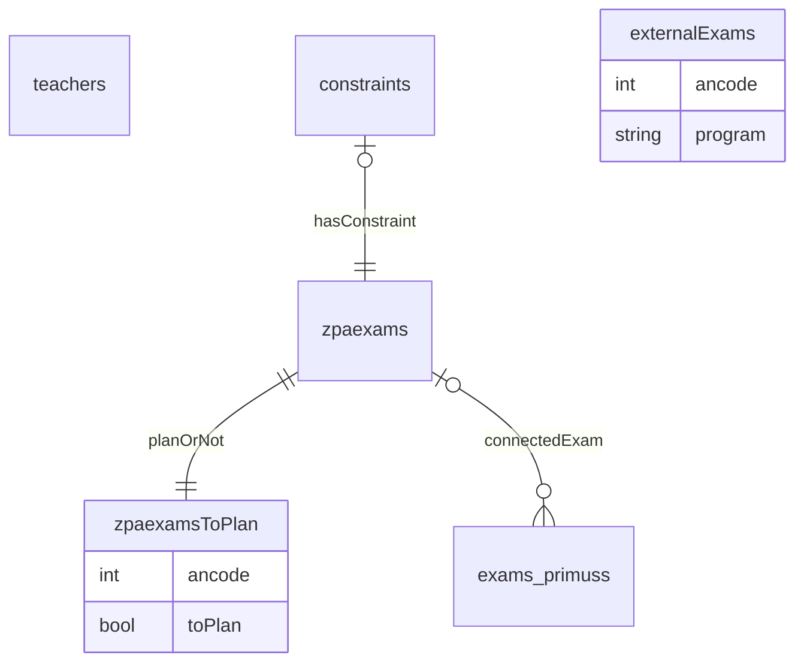
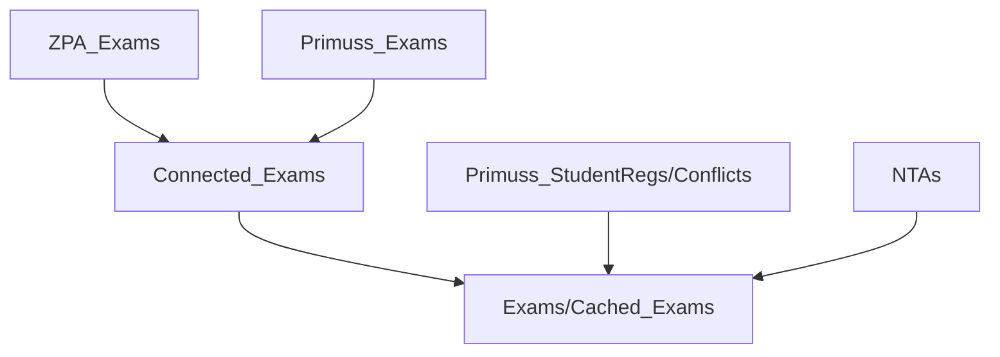

[](https://godoc.org/github.com/obcode/plexams.go)
[](https://goreportcard.com/report/github.com/obcode/plexams.go)

# plexams.go

- Import aus ZPA -- daher nicht verändern!
  - teachers
  - zpaexams

## Datenmodell



    additionalExam |o--o{ exams_primuss: connectedAdditionalExam

    conflicts_XY
    count_XY
    exams_XY
    studentregs_XY

## Ablauf



1. Prüfungen aus dem ZPA importieren (bei Änderungen erneut):

   ```
   plexams.go zpa exams
   ```

2. Dozierende aus dem ZPA importieren (bei Änderungen erneut):

   ```
   plexams.go zpa teacher
   ```

3. Prüfungen in `plexams.gui` auswählen, die geplant werden müssen.
4. (optional) zusätzliche Prüfungen einfügen, die beachtet werden müssen.
5. Besonderheiten (`constraints`) bei Prüfungen einpflegen.
6. Primuss-Daten per `Makefile` importieren.
7. Zuordnung ZPA <-> Primuss:

   ```
   plexams.go prepare connected-exams
   ```

   Kontrollieren in `plexams.gui`.

8. Evtl. Primuss-Anmeldungen korrigieren

   ```
   plexams.go primuss fix-ancode <program> <old-ancode> <new-ancode>
   ```

   und erneut zuordnen lassen (siehe 7.) oder zusätzlich zuordnen (siehe 9.)

9. Evtl. mit

   ```
   plexams.go prepare connect-exam  <ancode> <program>
   ```

   ein zusätzliches connecten

10. Primuss-Anmeldungen ins ZPA importieren

    ```
    plexams.go zpa studentregs
    ```

11. Zuordnung ZPA-Prüfungen zu Primuss-Anmeldungen fixieren.
12. Nachteilsausgleiche bei Prüfendernen per E-Mail melden/nachfragen

    ```
    plexams.go email nta -r
    ```

bis hier

13. MUC.DAI-Planung an Prüfungsplaner FK03 (DE), FK08 (GS), FK12 (ID)
14. Vorläufigen Plan ins ZPA und an Fachschaft
15. Plan im ZPA veröffentlichen
16. E-Mail Anforderungen an die Aufsichtenplanung

## Semester-Config initialisieren

Neue Semesterdatei interaktiv anlegen:

```
plexams.go init 2026-SS
```

- Schreibt am Ende `<semester>.yaml` in den konfigurierten `semester-path`.
- Eingaben sind interaktiv; `Enter` übernimmt den angezeigten Default.
- Bei Listenfeldern (z. B. `slots`, `forbiddenDays`, `additionalexamer`) löscht `-` den Default und speichert eine leere Liste.
- `slots` haben als Fallback die Standardwerte `08:30,10:30,12:30,14:30,16:30`.
