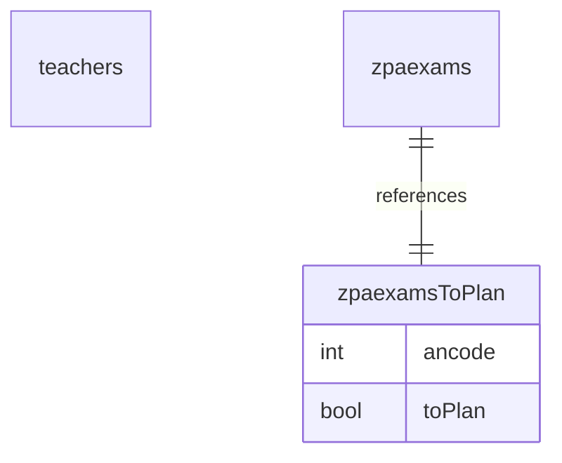

# plexams.go

- Import aus ZPA -- daher nicht verändern!
  - teachers
  - zpaexams

```mermaid
erDiagram
    teachers
    zpaexams
    zpaexamsToPlan {
        int ancode
        bool toPlan
    }
    zpaexams ||--|| zpaexamsToPlan: references
```
