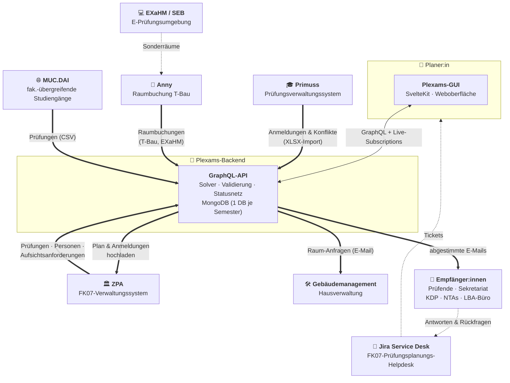
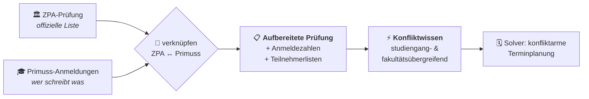
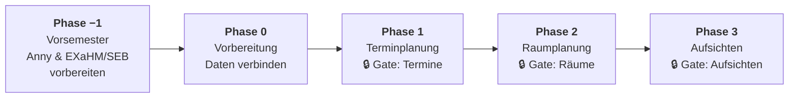
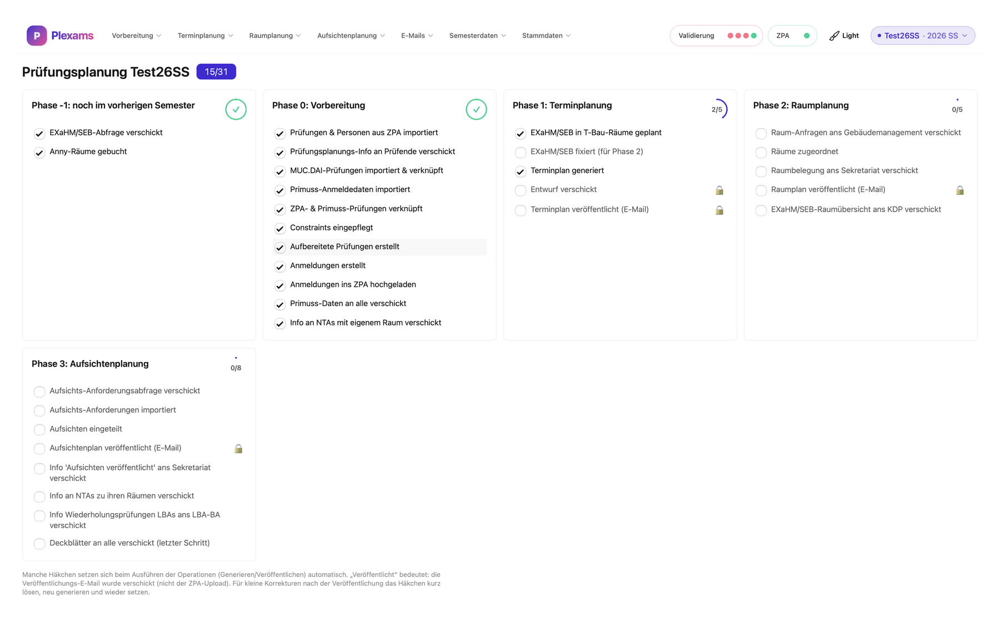
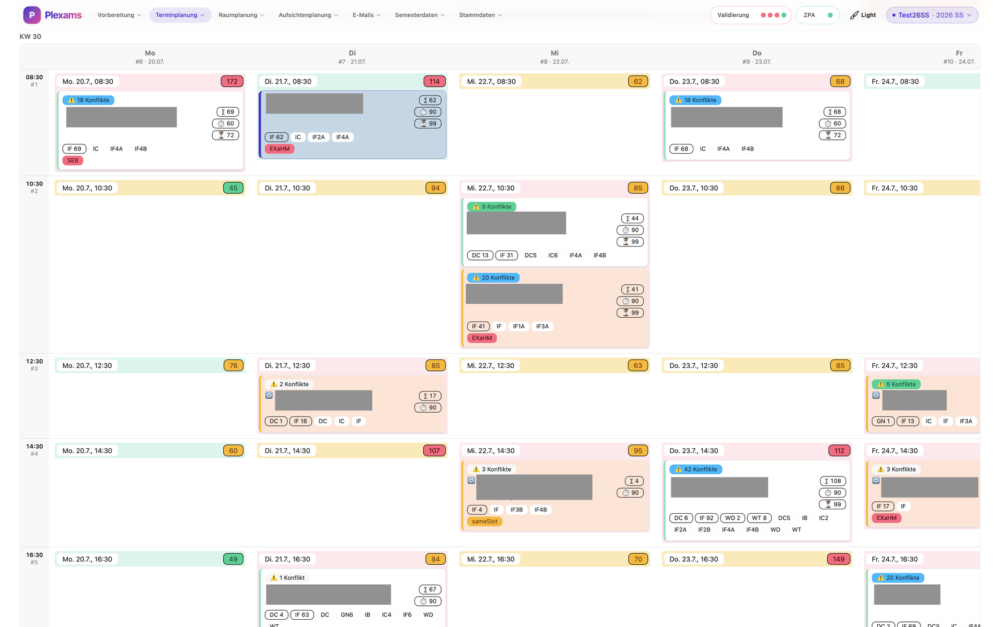
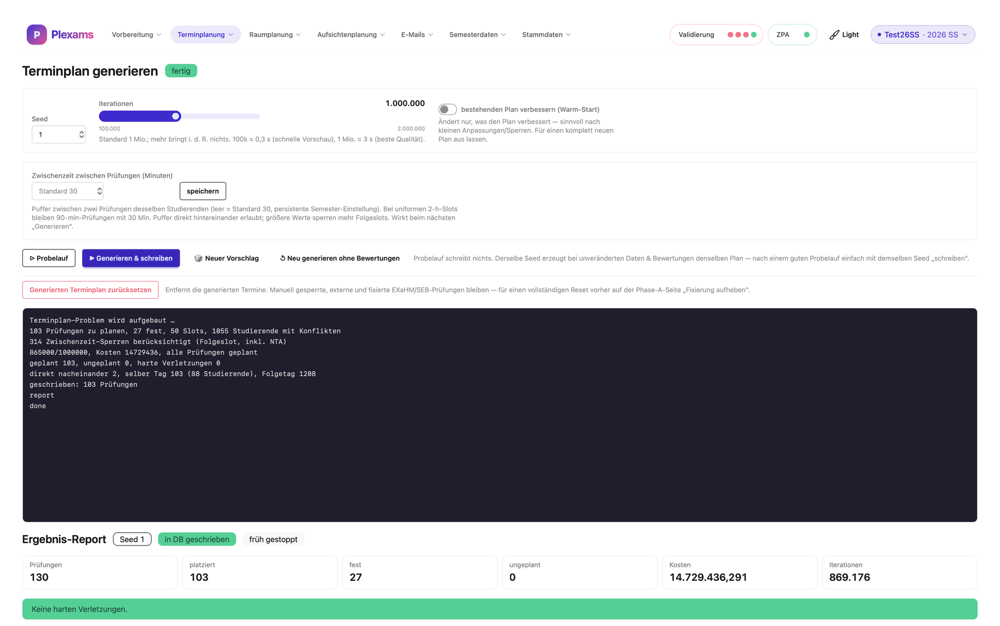
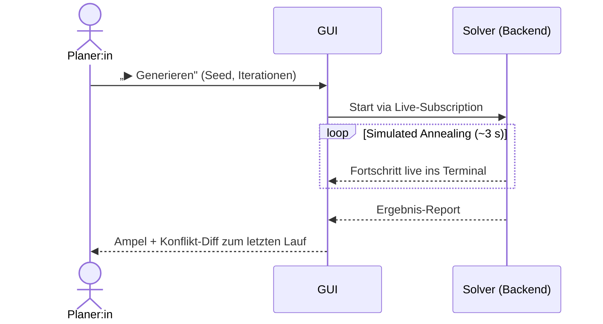
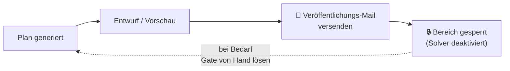
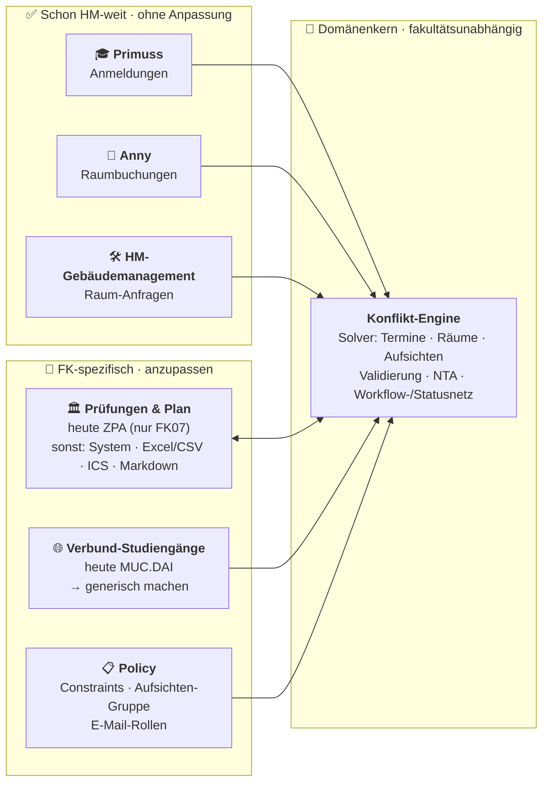
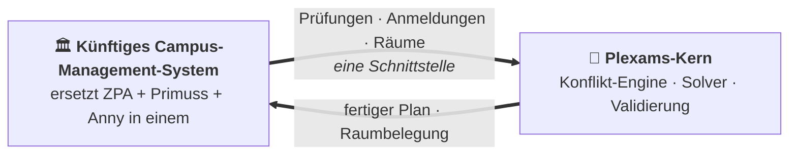

# Plexams — die Prüfungsplanung der FK07 in einem Werkzeug

> **In einem Satz:** Plexams bündelt den kompletten Lebenszyklus der
> Prüfungsplanung eines Semesters — von den Rohdaten aus fünf Fremdsystemen bis
> zum veröffentlichten Plan — und überlässt die eigentliche Schwerarbeit
> (Termine, Räume, Aufsichten) einem Optimierungs-Solver, den der Mensch nur noch
> anstößt und feinjustiert. **Der Mensch entscheidet und korrigiert, die Maschine
> platziert.**

Diese Doku erklärt **nicht den Code**, sondern *was das System tut, mit welchen
Nachbarsystemen es spricht und was ein:e Planer:in im GUI erlebt.*

---

## Inhalt

1. [Das große Bild — die Systemlandschaft](#1-das-große-bild--die-systemlandschaft)
2. [Die Nachbarsysteme](#2-die-nachbarsysteme)
3. [Vom Rohdatum zum Plan — der Datenfluss](#3-vom-rohdatum-zum-plan--der-datenfluss)
4. [Der Fahrplan — fünf Phasen, ein roter Faden](#4-der-fahrplan--fünf-phasen-ein-roter-faden)
5. [Was Planer:innen im GUI machen — die prägenden Bildschirme](#5-was-planerinnen-im-gui-machen--die-prägenden-bildschirme)
6. [Automatik vs. Handarbeit](#6-automatik-vs-handarbeit)
7. [Steuerung & Feedback — Statusnetz, Ampeln, Live-Terminals](#7-steuerung--feedback--statusnetz-ampeln-live-terminals)
8. [E-Mail- & Publish-Flows](#8-e-mail--publish-flows)
9. [Die Wow-Momente](#9-die-wow-momente)
10. [Ausrollen auf die ganze HM — was generisch ist und was angepasst wird](#10-ausrollen-auf-die-ganze-hm--was-generisch-ist-und-was-angepasst-wird)

---

## 1. Das große Bild — die Systemlandschaft

Plexams sitzt als **Dreh- und Angelpunkt** zwischen den Systemen der Hochschule.
Es zieht Daten aus ZPA, Primuss, Anny und MUC.DAI herein, verrechnet sie, und
gibt am Ende einen fertigen Plan zurück ans ZPA sowie eine Flut abgestimmter
E-Mails an alle Beteiligten.

Der Clou: **Jedes dieser Systeme kennt nur seinen Ausschnitt.** Das ZPA kennt die
Prüfungen, aber nicht, wer sie schreibt. Primuss kennt die Anmeldungen, aber
nicht die Räume. Anny kennt die Buchungen, aber nicht die Klausuren. Plexams ist
das einzige Werkzeug, das **alles zusammenführt** — und daraus einen
widerspruchsfreien Plan macht.

---

## 2. Die Nachbarsysteme

| System | Was es ist | Was hereinkommt | Was hinausgeht |
|---|---|---|---|
| 🏛️ **ZPA** | Verwaltungssystem der FK07 (hier wird u. a. der Prüfungsplan veröffentlicht) | offizielle Prüfungsliste, Prüfende, Aufsichtsanforderungen, Sperrtage | fertiger Terminplan + Anmeldungen (Upload zurück) |
| 🎓 **Primuss** | zentrales Prüfungsverwaltungssystem der HM (hier melden sich die Studierenden an) | Studierenden-Anmeldungen je Prüfung (XLSX-ZIP-Import) → **Konfliktwissen** | — |
| 🚪 **Anny** | Raumbuchungssystem für die T-Bau-Räume | Buchungen der Sonderräume (T3.015–T3.023) | — (Buchung erfolgt außerhalb, Plexams gleicht ab) |
| 🛠️ **Gebäudemanagement** | Hausverwaltung für Standardräume | — | Raum-Anfragen per E-Mail, Genehmigungen werden nachgepflegt |
| 🌐 **MUC.DAI** | fakultätsübergreifender Studiengang (Munich Data Science) | dessen Prüfungen per CSV, Verknüpfung mit ZPA-Ancodes | — |
| 💻 **EXaHM / SEB** | E-Prüfungsumgebung (EXaHM) bzw. Safe Exam Browser | Sonderklausuren, die spezielle Software/Räume brauchen | — (Räume laufen über Anny) |

---

## 3. Vom Rohdatum zum Plan — der Datenfluss

Der Kern der Magie steckt in einem einzigen Schritt: **ZPA-Prüfung** trifft auf
**Primuss-Anmeldung**. Erst dadurch weiß Plexams, *wer welche Prüfungen schreibt*
— und damit, *welche Prüfungen nicht gleichzeitig stattfinden dürfen.*

Aus diesem Konfliktwissen ergibt sich für jedes Prüfungspaar automatisch eine
Bewertung: *gleicher Slot / direkt nacheinander* (rot), *selber Tag* (gelb),
*unkritisch* (grün). Genau diese Bewertung füttert später den Terminplan-Solver
— und färbt im GUI das Slot-Raster ein.

---

## 4. Der Fahrplan — fünf Phasen, ein roter Faden

Plexams modelliert die gesamte Planung als **Meilenstein-Netz**: fünf Phasen mit
31 Bedingungen. Manche werden automatisch erreicht, wenn eine Operation fertig
läuft; alle lassen sich von Hand setzen. Einige tragen ein **🔒-Gate**: ist der
Meilenstein erreicht (= veröffentlicht), sperrt sich ein ganzer Bereich gegen
versehentliches Neu-Generieren.

Die Meilensteine im Detail (🔒 = Publish-Gate, das den Bereich danach sperrt):

| Phase | Meilensteine |
|---|---|
| **−1 · Vorsemester** | EXaHM/SEB-Abfrage verschickt · Anny-Räume gebucht |
| **0 · Vorbereitung** | Prüfungen & Personen aus ZPA importiert · Prüfungsplanungs-Info an Prüfende · MUC.DAI importiert & verknüpft · Primuss-Anmeldedaten importiert · ZPA ↔ Primuss verknüpft · Constraints eingepflegt · Aufbereitete Prüfungen erstellt · Anmeldungen erstellt · Anmeldungen ins ZPA hochgeladen · Primuss-Daten an alle verschickt · Info an NTAs mit eigenem Raum |
| **1 · Terminplanung** | EXaHM/SEB in T-Bau geplant · EXaHM/SEB fixiert · Terminplan generiert · 🔒 Entwurf verschickt · 🔒 Terminplan veröffentlicht |
| **2 · Raumplanung** | Raum-Anfragen ans Gebäudemanagement · Räume zugeordnet · Raumbelegung ans Sekretariat · 🔒 Raumplan veröffentlicht · EXaHM/SEB-Raumübersicht ans KDP |
| **3 · Aufsichtenplanung** | Aufsichts-Anforderungsabfrage verschickt · Anforderungen importiert · Aufsichten eingeteilt · 🔒 Aufsichtenplan veröffentlicht · Info ans Sekretariat · Info an NTAs zu ihren Räumen · Wiederholungsprüfungen ans LBA-Büro · Deckblätter an alle (letzter Schritt) |

Auf der Startseite des GUI wird dieses Netz zum **Cockpit**: Phasen-Karten mit
Fortschritts-Ringen (füllen sich, werden grün mit ✓) und einem Gesamtzähler wie
„15 / 31". Man sieht jederzeit, *was fehlt, was gesperrt ist und was als Nächstes
dran ist.*

*Das Cockpit: Jede Phase eine Karte, jeder Meilenstein eine Checkbox — erledigte
Ringe werden grün, 🔒-Gates sperren nach dem Veröffentlichen ganze Bereiche.*

---

## 5. Was Planer:innen im GUI machen — die prägenden Bildschirme

Die Kopfleiste ist bewusst **nach Planungsphase** gegliedert (nicht nach
Datenmodell): Vorbereitung → Terminplanung → Raumplanung → Aufsichtenplanung →
E-Mails → Semesterdaten. Man arbeitet sie im Grunde von links nach rechts ab.
Rechts oben leuchten dauerhaft zwei Status-Ampeln (Validierung, ZPA) und der
Semester-Umschalter.

Fünf Bildschirme machen den Charakter des Werkzeugs aus:

### ① Das Prüfungsplan-Raster — inspizieren statt schieben

Eine Tabelle aus **Tagen (Spalten) × Startzeiten (Zeilen)**, jede Zelle ein Slot.
Die Design-Überraschung: **Es gibt kein Drag-&-Drop.** Der Mensch schiebt keine
Prüfungen — das macht der Solver. Klickt man eine Prüfungskarte an, färbt sich das
**ganze Raster** für genau diese Prüfung:

- 🟩 **grün** = erlaubt · 🟨 **gelb** = ungünstig · 🟥 **rot** = verboten
- alle konfligierenden Prüfungen bekommen einen **roten Rand**
- jeder Slot trägt ein Ampel-Badge für die Teilnehmerzahl (grün < 50 < gelb < 100 < rot)
- Symbole erzählen den Rest: 🔁 Wiederholung · 🔒 manuell gesperrt · 🏗️ automatisch fixiert

Unten sammelt „💪 Alles geplant" bzw. „N Prüfungen noch einzuplanen" die offenen
Fälle. Eine zweite Ansicht zeigt die Prüfungen zeitproportional wie in einem
Kalender.

*Das Raster mit ausgewählter Prüfung: erlaubte Slots grün, ungünstige gelb,
verbotene rot; jede Karte zeigt Konfliktzahl, Teilnehmerzahl und Kennungen wie
🔁, EXaHM/SEB oder „sameSlot".*

### ② „Terminplan generieren" — der Solver mit Live-Terminal

Hier drückt die Planer:in den großen Knopf. Eingaben: **Seed** (reproduzierbar),
**Iterationen** (Slider 100 k – 2 Mio, „1 Mio ≈ 3 s, beste Qualität"),
**Warm-Start**-Toggle. Ein **Simulated-Annealing-Optimierer** rechnet und
protokolliert dabei **live** in ein dunkles Terminal-Fenster (ANSI-farbig, mit
in-place aktualisierter Fortschrittszeile).

*Ein Lauf in Zahlen: „130 Prüfungen, 27 fest, 50 Slots, 1055 Studierende mit
Konflikten … alle Prüfungen geplant, harte Verletzungen 0" — live im Terminal,
darunter der Ergebnis-Report und die grüne Ampel „Keine harten Verletzungen".*

Danach ein **Ergebnis-Report**: Kacheln „platziert / fest / ungeplant / Kosten /
Iterationen", ein Ampel-Alert „Keine harten Verletzungen", die Qualität *für
Studierende* (Prüfungen am selben/Folgetag) und ein Konflikt-Diff
„− weg / = geblieben / ＋ neu" gegen den letzten Lauf. Buttons: „▷ Probelauf"
(schreibt nichts), „▶ Generieren & schreiben", „🎲 Neuer Vorschlag".

> **Zweistufig:** Phase A platziert zuerst nur die EXaHM/SEB-Klausuren in die
> gebuchten T-Bau-Räume und **fixiert** sie (🏗️), sodass sie den großen Phase-B-Lauf
> unverändert überleben.

### ③ Das Konflikt-Panel — paarweise, mit Handlungsoptionen

Kein abstraktes Gitter, sondern **paarweise Konflikt-Tabellen** mit
farbcodierter Nähe (rot „gleicher Slot / direkt nacheinander", gelb „selber
Tag"), aufgeteilt in „Zu prüfen / Automatisch akzeptiert / Nur zur Info". Pro
Konflikt kann die Planer:in betroffene Studierende **einzeln akzeptieren**, per Veto
behandeln oder ein Paar als **„darf zeitgleich"** freigeben (echte
Parallelsektionen) — die Strafe verschwindet, *ohne den Plan neu zu würfeln.*

### ④ Raumzuordnung — ein Lauf, dann fixieren & sperren

Statt Räume einzeln zuzuweisen, klickt man **„Räume für Prüfungen zuordnen"** —
der Server verteilt **alle Studierenden algorithmisch**. Feinsteuerung über drei
Hebel: 📌 vorplanen/fixieren (überlebt die Neuzuordnung), Raum-Slots sperren
(Zelle anklicken → durchgestrichen), und eine rote Box „⚠ N Studierende noch ohne
Raum" mit Sprung-Badges. Besondere Räume tragen Spitznamen — der „rote Würfel"
(R1.046), die „blaue Tonne" (R1.049) — dazu NTA-, Labor- und Online-Räume.

### ⑤ Aufsichten einteilen — Solver + Tagesansicht

„▶ Einteilung starten" startet einen **zweiten Simulated-Annealing-Lauf** mit
demselben Live-Terminal und einem **Fairness-Report** (Balance / Abdeckung /
Ausreißer / Verteilung). Zum Nachjustieren dient die Tagesansicht: links
„verfügbare Aufsichten" (grün „will" / gelb „kann", sortiert nach offenen
Minuten), rechts die Räume je Slot — wählt man eine Person, färben sich ihre
Räume blau, unbesetzte Räume bleiben rot. Jede Person lässt sich per 📌 manuell
festnageln.

---

## 6. Automatik vs. Handarbeit

Die Arbeitsteilung ist überall gleich: **ein Knopf für die Schwerarbeit, feine
Hebel für die Korrektur.**

| Aufgabe | Automatik (Knopf) | Handarbeit / Korrektur |
|---|---|---|
| Datenaufbereitung | „Generieren" (aufbereitete Prüfungen) | Anmeldungen bereinigen, Constraints setzen |
| EXaHM/SEB-Termine | Phase A („Planen & schreiben") | fixieren (🏗️) |
| Gesamt-Terminplan | Phase B (Solver, Seed/Iterationen) | Konflikte akzeptieren / „darf zeitgleich" / 🔒 sperren |
| Räume | „Räume für Prüfungen zuordnen" | 📌 vorplanen, Slots sperren |
| Aufsichten | „Einteilung starten" (Solver) | 📌 vorplanen, Tagesansicht feinjustieren |
| Raum-Anfragen | „Vorschau laden" → „Übernehmen" | genehmigen / aktiv schalten |

---

## 7. Steuerung & Feedback — Statusnetz, Ampeln, Live-Terminals

Drei Elemente verwandeln ein fehleranfälliges Puzzle aus fünf Fremdsystemen in
einen nachvollziehbaren Ablauf:

- **Das Meilenstein-Netz (Startseite)** — Phasen-Karten mit Fortschritts-Ringen
  und Gesamtzähler; jede Bedingung eine anklickbare Checkbox, manche mit 🔒-Gate,
  das einen ganzen Bereich sperrt. Gelbe Warn-Banner melden gesperrte Bereiche.
- **Zwei dauerhafte Ampeln in der Navbar** — die **Validierungs-Pille** mit vier
  Punkten (Grundlagen / Terminplanung / Räume / Aufsichten), jeder
  grün/gelb/rot/grau, rot pulsierend; ein Klick startet eine Hintergrund-Prüfung,
  deren Zustand sogar einen Reload übersteht. Daneben die **ZPA-Ampel**.
- **Streamende Terminal-Läufe** — jeder Solver-Lauf, jeder Import, jeder
  E-Mail-Versand läuft live in einem dunklen Terminal mit, Zeile für Zeile, bis
  „✓ fertig" grün aufleuchtet.

---

## 8. E-Mail- & Publish-Flows

**E-Mails versenden:** Jeder Versand ist standardmäßig ein **Probelauf** — die
Mails gehen als `.eml`-Anhänge an die Planer:in selbst. Zwei Buttons pro Karte:
„Probelauf (nur an mich)" und „✉ Wirklich senden…" mit roter Sicherheitsabfrage.
Der Versand läuft live im Terminal mit; bereits gesendete Mails wandern nach
unten, sodass oben immer der nächste Schritt steht.

**E-Mail-Vorlagen direkt im GUI anpassen:** Sämtliche E-Mail-Texte sind
**Markdown-Vorlagen**, die sich unmittelbar im GUI bearbeiten lassen — ohne Code,
ohne Deployment. Zu jeder Vorlage zeigt der Editor die verfügbaren **Platzhalter**
(z. B. `{{ .Teacher.Fullname }}`) mit Erklärung und Beispielwert, dazu die
gemeinsamen Hilfsfunktionen (etwa `jiraURL` oder Singular/Plural). Eine
**Live-Vorschau** rendert die fertige Mail mit Beispieldaten schon beim Tippen und
meldet Fehler sofort; ein **Vergleich zum gespeicherten** bzw. zum
ausgelieferten Standardtext macht jede Änderung sichtbar, und ein Klick stellt die
eingebaute Standardvorlage jederzeit wieder her. So kann die Planer:in Formulierungen
selbst pflegen, ohne die eigentliche Mechanik (Empfänger, Anhänge, Versand) anzufassen.

**Rückmeldungen laufen gebündelt zurück:** Alle Antworten auf diese E-Mails
kommen über den **„FK07 Prüfungsplanungs"-Helpdesk** in
[Jira](https://jira.cc.hm.edu/servicedesk/customer/portal/13) — nicht als lose
Antwort-Mails im Postfach, sondern als nachvollziehbare, zuordenbare Tickets an
einer zentralen Stelle.

**Veröffentlichen an ZPA:** „Aus dem ZPA laden" (Download) und „Ins ZPA
übertragen" (Upload) — beide mit Live-Terminal, farbig markierten Änderungen
(„+ neu / − entfällt / ~ alt→neu") und einem Sync-Verlauf, der jeden Im-/Export
protokolliert.

**Die Sperren danach:** „Veröffentlicht" heißt im GUI = *Veröffentlichungs-Mail
verschickt.* Das setzt die Gate-Bedingung (Termine / Räume / Aufsichten) und
**sperrt den Bereich** — der Solver-Knopf wird inaktiv, ein gelbes Banner meldet
„🔒 … gesperrt". Zusätzlich gibt es einen DB-weiten Schreibschutz (read-only) und
eine Sperre, während eine Validierung oder ein Transfer läuft.

---

## 9. Die Wow-Momente

> *„Wie habe ich die Prüfungsplanung je ohne dieses Tool geschafft?"*

**⚡ Automatische Konflikterkennung über alle Studiengänge hinweg.** Aus den
Primuss-Anmeldungen weiß Plexams, welche:r Studierende welche Prüfungen schreibt
— und findet **jede** Überschneidung studiengang- und fakultätsübergreifend,
inklusive „direkt nacheinander" und „selber Tag". Von Hand über hunderte
Prüfungen und tausende Anmeldungen: praktisch unmöglich.

**🗓️ Der Terminplan-Solver.** Ein Simulated-Annealing-Lauf legt in **~3 Sekunden**
alle Prüfungen konfliktarm in die Slots — unter Beachtung sämtlicher Constraints
(Fixtermine, EXaHM/SEB, Räume, Zwischenzeiten), reproduzierbar per Seed,
verbesserbar per Warm-Start. Wochen-Handarbeit werden zum Knopfdruck.

**🏢 Automatische Raum- und Aufsichtenverteilung.** Ein Klick verteilt tausende
Studierende auf Räume; ein zweiter Solver verteilt die Aufsichten **fair nach
Soll-Minuten** und respektiert Sperrtage aus dem ZPA — mit Fairness-Report und
Ausreißer-Liste.

**♿ NTA-Handling (Nachteilsausgleich) end-to-end.** Die Planer:in pflegt nur den
Bescheid ein (Verlängerung in %, „eigener Raum", „spezielle Hardware"). Das
Werkzeug rechnet die individuelle verlängerte Dauer selbst aus (+25 % → 90 Min.),
markiert Einzelraum-/Hardware-Bedarf, berücksichtigt ihn **automatisch** in Raum-
und Aufsichtenplanung und stellt die vorformulierten Benachrichtigungs-Mails
bereit.

**🧭 Der geführte Workflow.** Meilenstein-Netz mit Gates, dauerhafte
Validierungs-Ampeln und streamende Live-Läufe machen aus einem Puzzle mit fünf
Fremdsystemen eine klare, nachvollziehbare Reihenfolge — man sieht jederzeit, was
fehlt, was gesperrt ist und was der letzte Lauf verändert hat.

---

## 10. Ausrollen auf die ganze HM — was generisch ist und was angepasst wird

Plexams ist heute an einem konkreten FK07-Ökosystem gewachsen. Der entscheidende
Punkt für einen HM-weiten Einsatz: **Der eigentliche Wert steckt nicht in den
Anbindungen, sondern im fakultätsunabhängigen Kern** — der Konflikt-Engine, den
drei Solvern (Termine, Räume, Aufsichten), der Validierung, dem NTA-Handling und
dem Workflow-/Statusnetz. Und das Beste: **Der größte Teil der Anbindungen ist
bereits HM-weit** und funktioniert für jede Fakultät *ohne jede Anpassung.*

### Was schon heute HM-weit funktioniert — ohne Anpassung

Drei der fünf Nachbarsysteme nutzt die **ganze HM**. Für diese Bausteine ist bei
einem Rollout schlicht **nichts zu tun**:

- 🎓 **Primuss** — das zentrale Prüfungsverwaltungssystem der HM. Alle Fakultäten
  melden hier an; die Anmelde-Anbindung greift überall unverändert.
- 🚪 **Anny** — das Raumbuchungssystem. Von allen genutzt; der Abgleich läuft
  fakultätsunabhängig.
- 🛠️ **HM-Gebäudemanagement** — die zentrale Hausverwaltung. Die Raum-Anfragen
  gehen bereits an dieselbe Stelle, egal aus welcher Fakultät.

**Der einzig wirklich FK07-spezifische Baustein ist das ZPA** — es gibt es nur an
der FK07. Nur hier braucht eine andere Fakultät einen anderen Weg, woher die
Prüfungsliste kommt und wohin der fertige Plan veröffentlicht wird.

### Was wirklich anzupassen wäre

| Baustein | Heute (FK07) | Für andere FKs |
|---|---|---|
| **Prüfungen & Plan** | ZPA-REST (nur an der FK07) — Import der Prüfungsliste **und** Upload des fertigen Plans | ein Adapter für die jeweilige Quelle/Ziel: anderes System, **Excel/CSV** herein, **ICS / Markdown / Excel** oder System-Upload hinaus |
| **Verbund-Studiengänge** | fest verdrahtetes **MUC.DAI** | zu einem **generischen Verbund-Studiengang-Konzept** verallgemeinern (mehrere Programme, beliebige beteiligte FKs) |
| **Constraints / Regeln** | FK07-Policy (Slots, Sperrtage, Sonderfälle) | konfigurierbare Regelsätze pro FK — der Solver bleibt gleich, nur **Gewichte & Regeln** variieren |
| **Aufsichten** | FK07-Gruppe & -Anforderungen | andere zuständige Gruppe, andere Fairness-/Soll-Regeln, ggf. ganz abschaltbar |
| **E-Mail-Rollen & Texte** | Prüfende, Sekretariat, KDP, NTA, LBA-Büro | pro FK andere Rollen/Verteiler; Texte sind Markdown-Vorlagen, **im GUI editierbar** (mit Platzhalter-Hilfe & Live-Vorschau) |

### Was **nicht** angefasst werden muss — das wiederverwendbare Kapital

- **Konflikt-Engine & Solver** — arbeiten auf abstrakten Prüfungen, Anmeldungen,
  Räumen und Slots. Woher diese Objekte stammen, ist ihnen egal.
- **Validierung, NTA-Handling, Workflow-/Statusnetz mit Gates, Live-Terminals,
  Probelauf-Prinzip** — alles fakultätsneutrale Bausteine.
- **Primuss-, Anny- und Gebäudemanagement-Anbindung** — laufen HM-weit schon so.
- **Der Mandanten-Schnitt ist schon da:** jede Semester-Instanz ist eine eigene
  Datenbank, die Konfiguration liegt in der DB. Der Sprung zu „**eine Instanz je
  Fakultät**" ist damit ein kleiner, kein struktureller.

### Ausblick: Anbindung ans künftige Campus-Management-System

Genau hier zahlt sich die saubere Trennung aus. Das **künftige
Campus-Management-System**, an dem Sie gerade arbeiten, soll **ZPA, Primuss und
Anny in einem System zusammenführen.** Für Plexams heißt das: Statt drei
Anbindungen genügt **eine einzige Schnittstelle** — und der letzte
FK-spezifische Sonderfall (das ZPA) verschwindet dabei ganz.

Weil Plexams schon heute **über klar abgegrenzte Import-/Export-Grenzen** mit
seinen Nachbarsystemen spricht, ist die Anbindung an das neue CMS kein Umbau,
sondern ein **Umstecken der Adapter** auf einen einzigen, sauber definierten
Endpunkt. Liefert das CMS Prüfungen, Anmeldungen und Räume gemeinsam, wird
Plexams damit **HM-weit praktisch plug-and-play** — der Kern (Konflikterkennung,
Solver, Validierung, Workflow) läuft unverändert weiter, egal welche Fakultät ihn
nutzt.

> **Für das HM-weite Vorhaben (inkl. Stundenplanung):** Der wiederverwendbare Kern
> ist nicht „ein Prüfungsplaner", sondern eine **Constraint-getriebene
> Scheduling-Maschine mit geführtem Workflow**. Genau dieselbe Konflikt-/Solver-/
> Validierungs-Architektur trägt auch Stundenplanung — es ändern sich die Objekte
> (Lehrveranstaltungen statt Prüfungen) und die Constraints, nicht das Prinzip.

---

**Plexams** · Prüfungsplanung FK07 · Hochschule München
*Der Mensch entscheidet und korrigiert — die Maschine platziert.*

